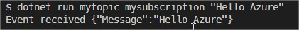
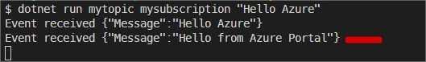

# .NET Core Events

Tests and Implementations of Service Bus. There is still a lot of work to be done.

## Todo

- [x] Implement integration with Azure Service Bus
- [ ] Implement these services with ASP.NET Core

## Azure

> To use Topics you need to select the **Pricing Tier - Standard**


You can run this application with parameters where:

- [0] = Your Service Bus Topic
- [1] = Your Service Bus Subscription
- [2] = The message to be sent

```
dotnet run mytopic mysubscription "Hello Azure"
```



Events can also be triggered from the Azure Portal.

In the Topic page on the left menu select **Service Bus Explorer (preview)**



