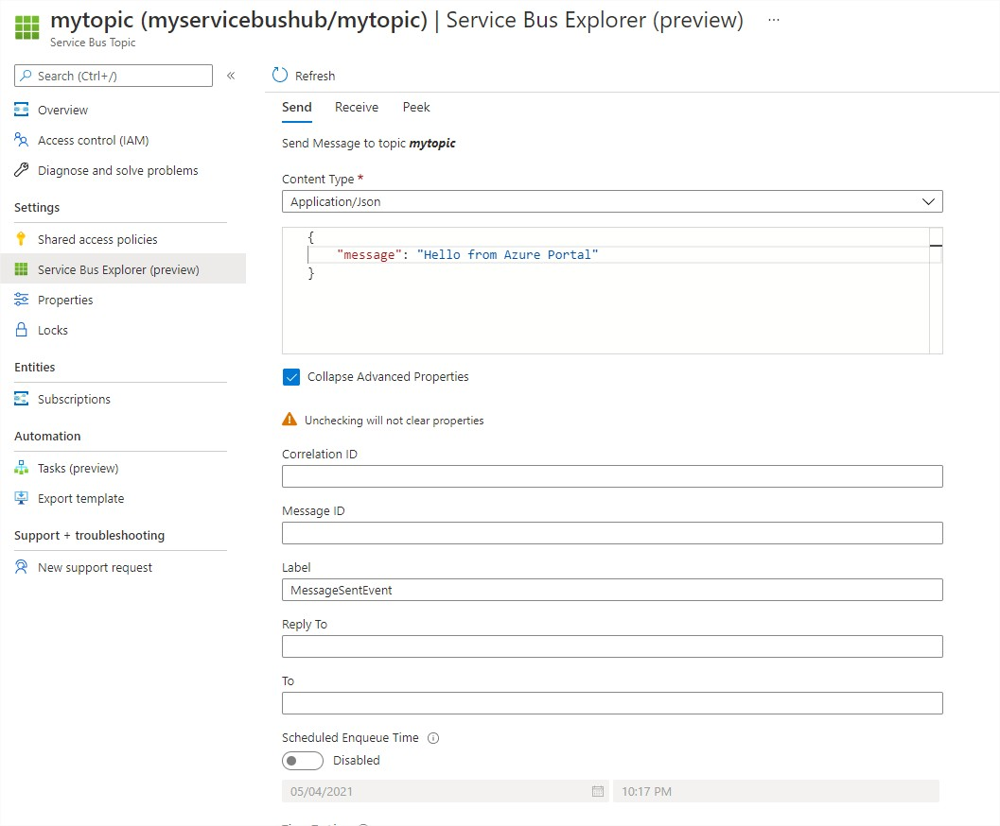

# .NET Core Events

Tests and Implementations of Service Bus. There is still a lot of work to be done.

## Todo

- [x] Implement integration with Azure Service Bus
- [ ] Implement these services with ASP.NET Core

## Azure

> To use Topics you need to select the **Pricing Tier - Standard**


You can run this application with parameters where:

- [0] = Your Service Bus Topic
- [1] = Your Service Bus Subscription
- [2] = A filter for the subscription. In this case the application uses a **System** filter called **To** (Optional)
- [3] = The message to be sent (Optional)

```powershell
dotnet run mytopic mysubscription toFilter "Hello Azure"
```

Or run the application as a receiver with filter.

```powershell
dotnet run mytopic mysubscription toFilter
```

Or just run without filter receiving all messages from the topic

```powershell
dotnet run mytopic mysubscription
```

Events can also be triggered from the Azure Portal.

In the Topic page on the left menu select **Service Bus Explorer (preview)**

- **Label** is name of the class that implements the interface **IEvent**



### With Filter

- In the Topic page select the subscription
- Click **Add filter**
- Select **Correlation Filter**
- In the **System Properties** select **To**


